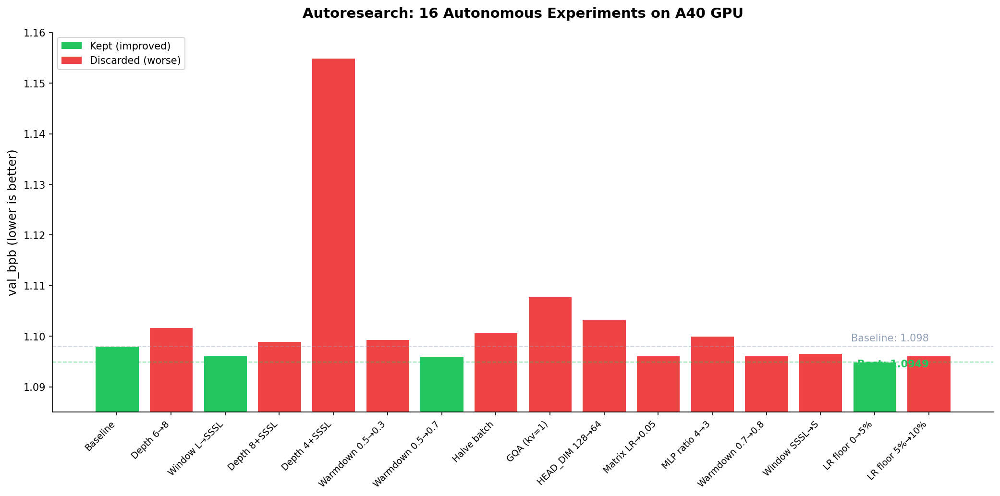
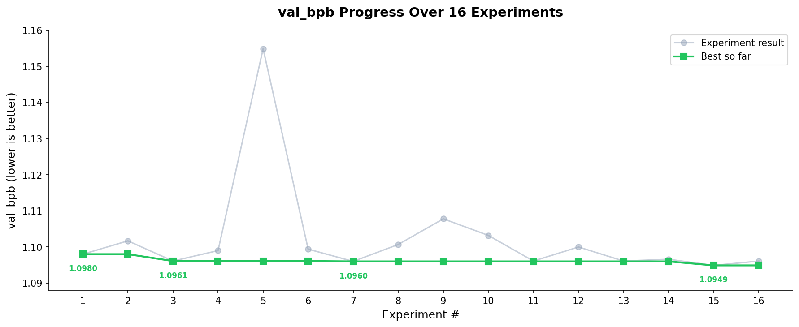
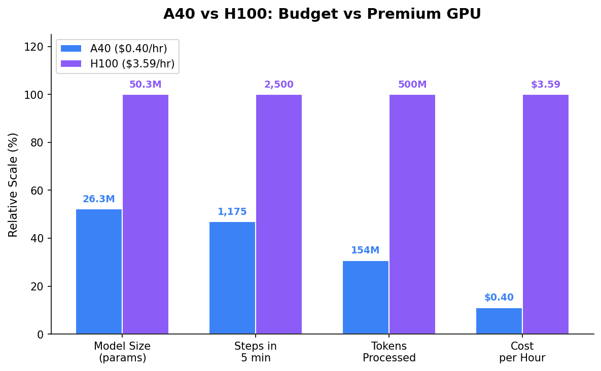

# Autoresearch on a Budget: 16 Autonomous Experiments on an A40 GPU

> Fork of [karpathy/autoresearch](https://github.com/karpathy/autoresearch) — ran on an NVIDIA A40 ($0.40/hr) instead of an H100. 16 experiments, 4 improvements, ~$15 total cost.

## Results Summary

| Metric | Value |
|--------|-------|
| Experiments run | 16 |
| Improvements found | 4 |
| Baseline val_bpb | 1.0980 |
| **Best val_bpb** | **1.0949** |
| Total cost | ~$15 |
| GPU | NVIDIA A40 (48GB, $0.40/hr on RunPod) |
| Agent | Claude Sonnet via Claude Code |

## Results





## All Experiments

| # | What Changed | val_bpb | Kept? |
|---|-------------|---------|-------|
| 1 | Baseline (depth=6, full attention) | 1.0980 | Yes |
| 2 | Depth 6 to 8 | 1.1017 | No |
| 3 | **Window L to SSSL** | **1.0961** | **Yes** |
| 4 | Depth 8 + SSSL | 1.0990 | No |
| 5 | Depth 4 + SSSL | 1.1549 | No |
| 6 | Warmdown 0.5 to 0.3 | 1.0994 | No |
| 7 | **Warmdown 0.5 to 0.7** | **1.0960** | **Yes** |
| 8 | Halve batch size for 2x steps | 1.1007 | No |
| 9 | GQA (n_kv_head=1) | 1.1078 | No |
| 10 | HEAD_DIM 128 to 64 | 1.1032 | No |
| 11 | Matrix LR 0.04 to 0.05 | 1.0961 | No |
| 12 | MLP ratio 4 to 3 | 1.1000 | No |
| 13 | Warmdown 0.7 to 0.8 | 1.0961 | No |
| 14 | Window SSSL to all short (S) | 1.0966 | No |
| 15 | **LR floor 0 to 5%** | **1.0949** | **Yes** |
| 16 | LR floor 5% to 10% | 1.0961 | No |

## Key Findings

### What worked

1. **Sliding window attention (SSSL)** — Alternating 3 short-window layers + 1 full-attention layer is cheaper per step, so the model trains more steps in 5 minutes.

2. **Higher warmdown ratio (0.7)** — Spending 70% of training time decaying the learning rate (vs 50%) gave consistent gains. Agent confirmed 0.7 is the sweet spot by testing 0.3, 0.5, 0.7, and 0.8.

3. **Learning rate floor at 5%** — Best single discovery. Keeping a small LR floor prevents over-annealing — the model keeps learning at the end of training instead of stalling. 10% was too high.

### What didn't work

- **Bigger models (depth 8)** — Only 339 steps vs 1,175 at depth 6. Not enough training time to converge on A40.
- **Smaller MLPs (ratio 3)** — Lost capacity faster than it gained speed.
- **GQA (1 KV head)** — Too aggressive for a 3-head model at this scale.
- **Halving batch size** — More steps but noisier gradients. Noise won.

## A40 vs H100



| Metric | A40 ($0.40/hr) | H100 ($3.59/hr) |
|--------|---------------|-----------------|
| VRAM | 48 GB | 80 GB |
| Optimal depth | 6 layers | 8+ layers |
| Model size | 26.3M params | 50.3M params |
| Steps in 5 min | 1,175 | ~2,500 |
| Tokens processed | 154M | ~500M |
| Cost for 16 experiments | ~$1.60 | ~$14.36 |
| Experiments per $10 | ~100 | ~11 |

**Key insight:** The optimal model architecture is hardware-dependent. On A40, depth=6 wins because it gets enough training steps. On H100, depth=8+ would win because the GPU is fast enough to train larger models sufficiently.

## A40-Specific Tuning

If you want to run autoresearch on an A40, change these defaults in `train.py`:

```python
DEPTH = 6               # down from 8
DEVICE_BATCH_SIZE = 64   # down from 128
TOTAL_BATCH_SIZE = 2**17 # down from 2**19
WINDOW_PATTERN = "SSSL"  # or start with "L" as baseline
```

## How to Reproduce

```bash
# 1. Rent an A40 on RunPod ($0.40/hr)

# 2. Setup
curl -LsSf https://astral.sh/uv/install.sh | sh
source $HOME/.local/bin/env
git clone https://github.com/abhid1234/autoresearch-experiments.git
cd autoresearch-experiments
git checkout autoresearch/mar22
uv sync

# 3. Prepare data
uv run prepare.py

# 4. Run baseline
uv run train.py

# 5. Install Claude Code and run the agent
npm install -g @anthropic-ai/claude-code
export ANTHROPIC_API_KEY="your-key"
claude
# Then prompt: "Have a look at program.md and let's kick off a new experiment!"
```

## Full Writeup

Read the detailed blog post with charts and analysis: [Substack](https://abhid.substack.com/)

## Credits

- Original project: [karpathy/autoresearch](https://github.com/karpathy/autoresearch)
- Agent: Claude Sonnet via [Claude Code](https://claude.ai/code)

## License

MIT
